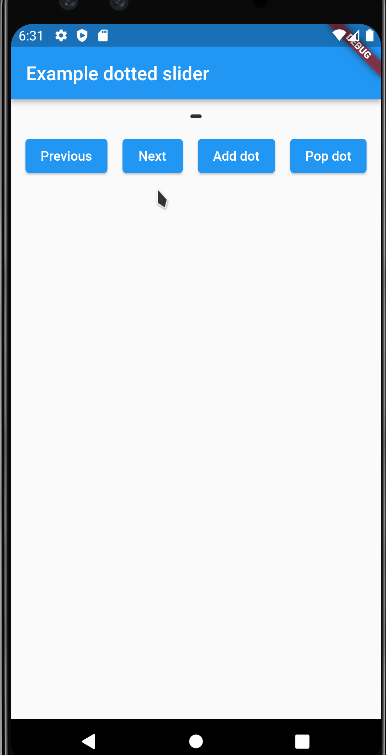

# DottedSlider

A flutter animated dotted slider




# Reference

```dart

SliderController({
    required this.selected,
    required this.dots,

    this.infinite = false
});

DottedSlider({
    Key? key,

    required this.controller,

    this.dotColor = const Color(0xff333333),
    this.animationDuration = const Duration(milliseconds: 300),

    this.dotSize = 4,
    this.dotScaleFactor = 3.0,

    this.dotGap = 4,

    this.mainAxisAlignment,
    this.crossAxisAlignment,
});

```
